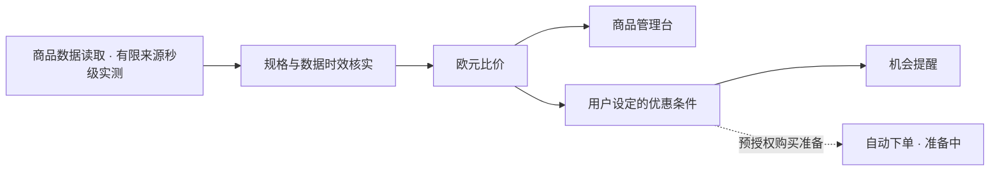

# Arc'teryx Deal Sentinel

### 秒级读取商品数据 · 真实变更时效验证中

**德国官方 Outlet 的有限测试已验证秒级读取；真实价格与库存变化的发现时效仍在验证。** 我们正在为自动下单做好准备，让用户在一个页面里发现不同款式的优惠，选定颜色与尺码，找到已覆盖渠道中的最低欧元报价。

Arc'teryx Deal Sentinel 面向需要反复比较国家、商家与商品规格的用户，目标是把分散的报价整理成直观的商品橱窗：图片、款式、颜色、尺码、价格和核实时间集中展示，让每次购买都有清楚的比较依据。

> 秒级读取不等于秒级发现降价或补货。跨渠道管理台正在建设，预授权自动下单处于产品规则与流程准备阶段。

## 秒级读取已有实测，真实变更时效正在验证

在 2026-09-07 对德国官方 Outlet 男装目录的一组有限现场测试中，我们测量了**读取返回数据的耗时**。以下数字不衡量真实库存的新鲜程度，也不是从商家变更到发现或通知用户的延迟：

| 实测项目 | 结果 |
| --- | --- |
| 首轮商品列表与详情读取 | **约 2.06 秒** |
| 后续 8 轮商品列表检查的平均请求耗时 | **约 1.22 秒** |
| 本次取得的商品与规格 | **101 款商品 / 1,183 个规格变体** |

我们将速度作为核心产品能力，持续缩短从取得报价、识别优惠到提醒与购买准备的等待。

同批商品详情响应出现约 55 分钟的 HTTP 缓存年龄。这不表示价格或库存一定有误，但说明快速读取也可能取得较早生成的数据。我们正在验证从官方首次可观察到变化，到系统发现、管理台显示及通知的实际延迟；目前尚无这一完整流程的实测结论。

## 打开就能发现优惠

首页按款式呈现紧凑的商品卡片。Alpha SV、Beta、Atom、Gamma 等商品各自聚合颜色与尺码，用户可以同时浏览更多不同款式，再点开感兴趣的商品进行比较。

本地商品卡片原型集中展示：

- **商品图片与名称**：清楚区分性别、版本和型号。
- **最低欧元报价**：说明对应的颜色、尺码和报价渠道。
- **相对德国官网的节省比例**：默认从高到低排列。
- **颜色与有货尺码**：紧凑呈现，选择尺码后重新计算价格和排名。
- **报价核实时间**：帮助判断这条购买机会是否仍值得查看。

## 同款、同规格，价格才值得比较

选择商品后，可进一步比较不同渠道的同一颜色、尺码与版本。首页未指定规格时展示最低起价，并明确最低价所适用的规格；选定规格后，展示该规格的最低报价。

所有外币报价统一换算为 EUR，并保留原币金额和汇率时间。节省比例统一参考**德国官网同款的可核实原价**，避免不同商家的原价口径影响排名。缺少可靠原价时，仍展示报价，节省比例留空。

**展示的是已覆盖渠道中的有效报价。** 渠道覆盖、库存和核实时间随结果一起呈现，过期报价与历史低价单独保留。当前比价范围为商品标价，不包含运费、额外税费及支付手续费。

## 让值得买的机会主动找到你

计划支持为关注商品设置最高价格或目标节省比例，并限定可接受的颜色、尺码和商家。报价达到条件后，通过统一通知网关连接后续配置的提醒渠道。

## 正在为自动下单做好准备

**产品正从“发现优惠”向“按用户条件及时行动”延伸。** 已明确预授权自动下单所需的产品规则：具体版本、允许颜色与尺码、目标节省比例、购买数量、商家范围和最高结账预算。

目标流程是：一旦取得符合条件的有效报价，立即触发提醒，并在用户事先授权的范围内启动购买；两个流程互不等待。订单结果需要可核实，并防止重复购买。

当前正在进行产品规则与流程准备，商家结账适配、支付配置及自动下单执行器仍待实现和验证，尚未开放自动付款。

## 当前进展

| 阶段 | 已完成或正在推进的内容 |
| --- | --- |
| **秒级读取已验证** | 2026-09-07 德国官方 Outlet 男装有限实测：首轮列表与详情读取约 2.06 秒，随后 8 轮列表请求平均约 1.22 秒，取得 101 款商品、1,183 个规格变体。这些是读取耗时，不是实际变更发现或通知延迟。 |
| **真实变更时效验证中** | 区分请求耗时、源站缓存和价格库存变化的发现延迟；尚未验证秒级发现真实降价、补货或全流程通知。 |
| **已有本地研究与操作台** | 已整理 24 个国家与地区、88 个市场渠道入口及 113 条商品报价记录，支持筛选与导出；这些是带证据的查询快照，尚非全部渠道持续更新。 |
| **建设中** | 扩充可持续获取报价的渠道，将采集结果衔接到面向用户的比价管理台。 |
| **已有本地商品原型** | 多商品卡片首页、颜色尺码展开、统一 EUR 报价、德国官网原价基准和节省比例排序；实际数据时效与持续服务仍在验收。 |
| **待接入与验证** | 持续更新的汇率服务、统一通知网关和用户自定义优惠规则的完整闭环。 |
| **自动下单准备中** | 已明确预授权购买条件、数量和预算规则；商家结账适配与自动下单执行器待实现、待验证。 |

目前的有限采集结果不代表全渠道覆盖或全天候服务已经完成。产品关注从发现报价到展示机会的实际延迟；源站缓存与库存更新节奏会影响数据时效，秒级检查不能直接等同于秒级真实库存。

## 产品结构与目标流程

进一步了解：[产品体验与比较规则](docs/product.md) · [服务方式与交付范围](docs/service.md)。

## 关于本仓库

这里展示产品定位、比较规则和阶段进展。核心实现与部署材料不在本仓库分发。产品计划以持续维护的订阅服务交付，服务范围、演示安排与开放方式将在确认后更新。

项目维护者：[yusongcao2004](https://github.com/yusongcao2004)。

本项目独立开发，与 Arc'teryx 不存在官方隶属、赞助或背书关系。商品名称及商标归其各自权利人所有。
